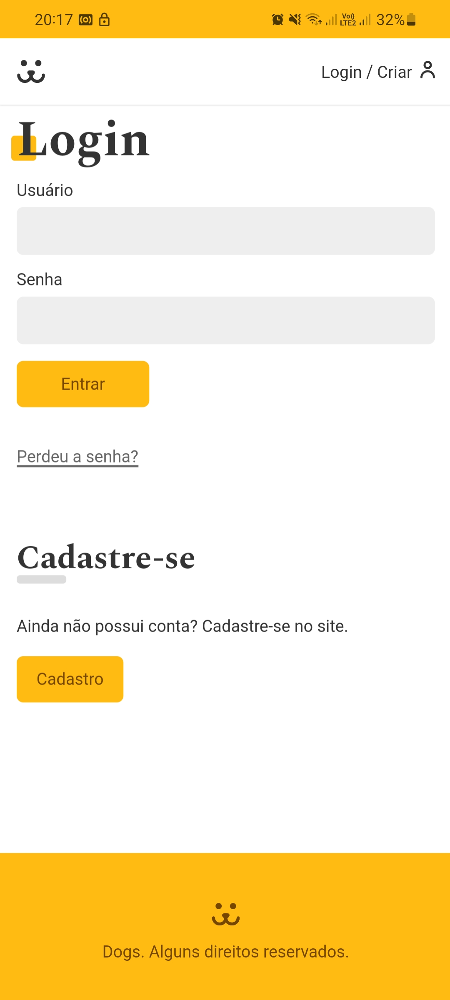

# Dogs 

<h4>Este é o maior projeto que eu já me dediquei. O projeto trata-se de uma rede social canina, o projeto foi todo pensado e escrito desde o momento da criação da API
até a criação de custom hooks, uso de inumeros componentes, requisições API, páginas de criação de login, autenticação, posts de fotos, comentários e visualizações de
fotos postadas de outros usuarios, perfis de outros usuários e tudo que podemos encontrar em uma rede social completa. Espero que gostem</h4>


https://user-images.githubusercontent.com/108480175/227060007-04b524d4-5c61-4091-b0e9-641572767e6b.mp4

https://user-images.githubusercontent.com/108480175/227060134-9c2b9b94-3c65-4c80-91df-cfba59c0d1b1.mp4

https://user-images.githubusercontent.com/108480175/227060144-7669f9e9-56bc-409b-a671-b515885fed34.mp4


<h1 align="center" height="100px" width="50px"></h1>

<h1></h1>


<h2>Confira este projeto acessando o link abaixo:</h2>
<a target="_blank" href="https://leandrorosadev.github.io/Dogs">Acesse esse Projeto</a>

<h2> Ou rode este projeto localmente em sua workstation:</h2>
<h3>Pré-requisitos</h3>
<h4>Antes de começar você precisa ter instalado em sua máquina as seguintes ferramentas: 
<a target="_blank" href="https://git-scm.com/downloads">Git</a>,
<a target="_blank" href="https://classic.yarnpkg.com/lang/en/docs/install/#windows-stable">Yarn</a>
e um editor de Texto como o <a target="_blank" href="https://code.visualstudio.com/download">VSCode</a> para trabalhar com o código</h4>

```bash
# Clone este repositório
$git clone <https://github.com/LeandroRosaDev/Dogs>

#Acesse a pasta do projeto no terminal/CMD
$cd Dogs

#instale as dependencias
$yarn

#Execute a aplicação em modo de desenvolvimento
$yarn start

#O servidor iniciará na porta 3000 - acesse <http://localhost:3000

``` 

### Tecnologias: 
React;

Css;


### Features Realizadas recentemente
- [x] Tema amarelo
- [x] Inicio da responsividade


### Features Futuras
- [x] Responsividade mais robusta


<h2>Autor</h2>
<h3>Leandro Rosa 👨🏻‍💻</3>
<h4>Confira meu Linkedin no link a seguir: <a target="_blank" href="https://www.linkedin.com/in/leandro-rosa-28ba8722a/">Leandro Rosa</a></h4>
